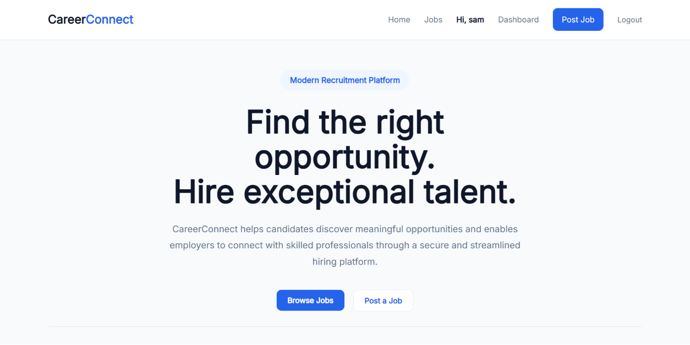
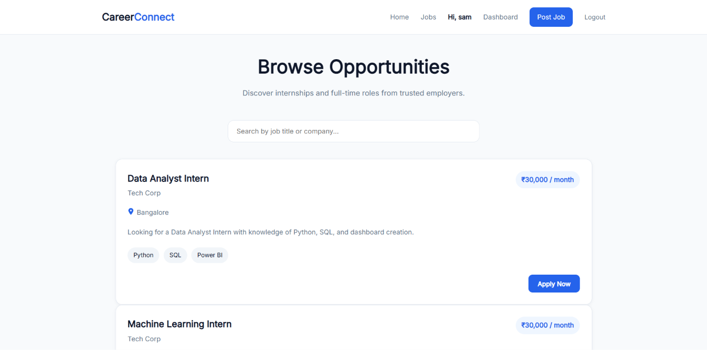
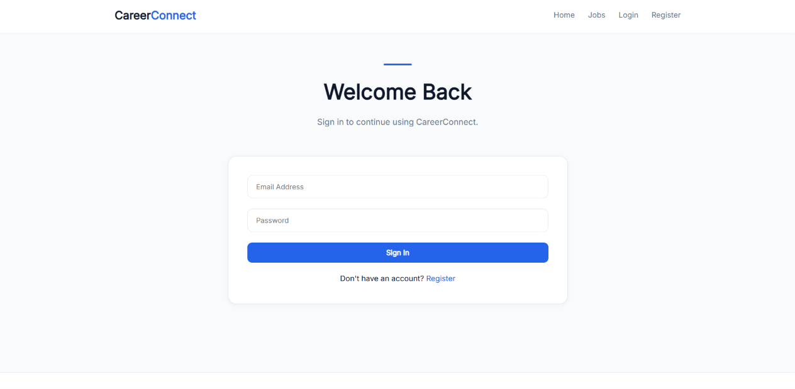
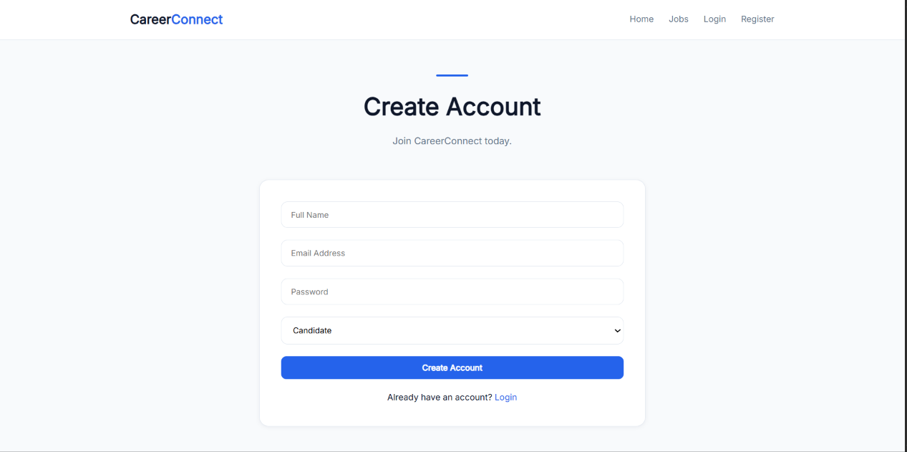
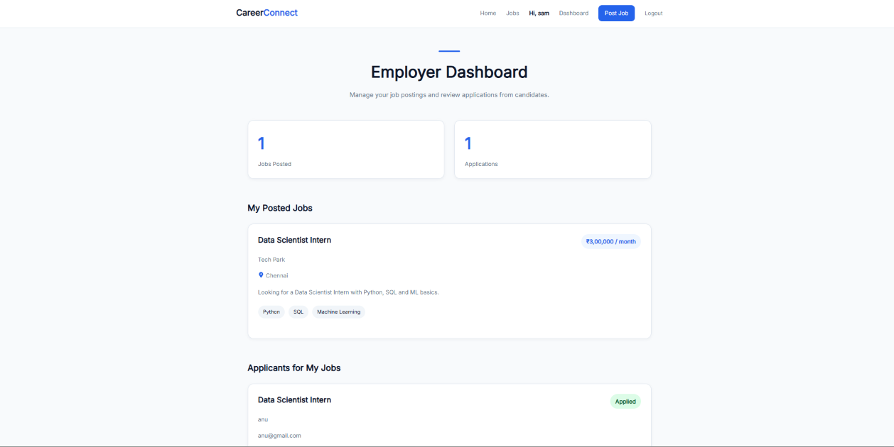
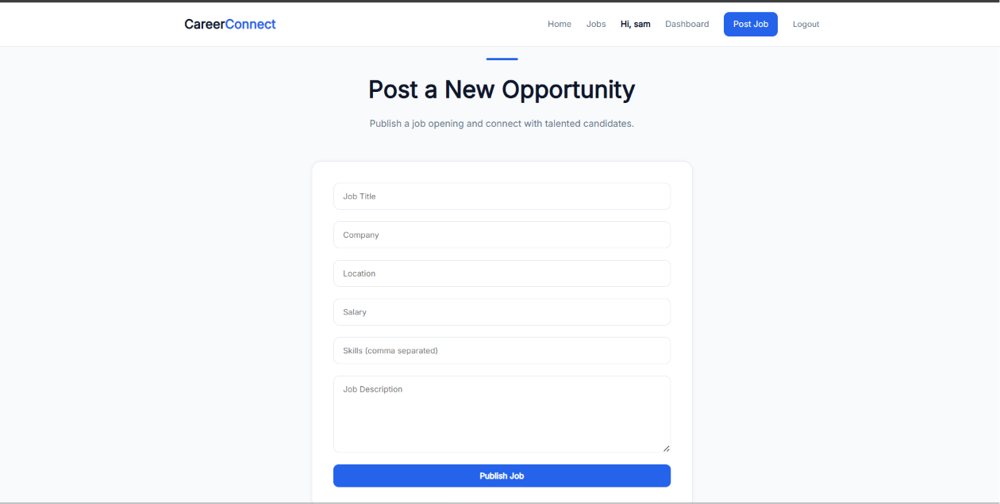
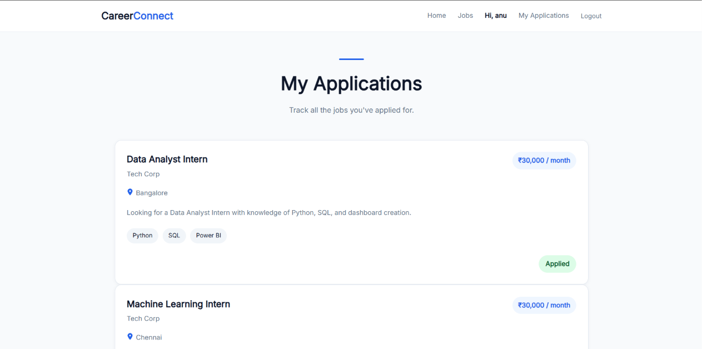

# CareerConnect - MERN Job Portal

A modern full-stack job portal built with the MERN stack that connects employers and candidates through secure authentication, job management, and application tracking.

## 🌐 Live Demo

**Frontend:** https://careerconnect-mern-ten.vercel.app

**Backend API:** https://careerconnect-mern.onrender.com

## Features

### Candidate
- Register & Login
- Browse available jobs
- Search jobs by title or company
- Apply for jobs
- View application history

### Employer
- Register & Login
- Post new jobs
- View posted jobs
- View applicants
- Employer dashboard

### General
- JWT Authentication
- Role-based authorization
- Responsive UI
- Live homepage statistics
- Salary formatting
- Modern card-based interface
- MongoDB database integration

## Tech Stack

### Frontend
- React
- Vite
- React Router
- Axios
- CSS3

### Backend
- Node.js
- Express.js
- MongoDB
- Mongoose
- JWT Authentication
- bcrypt.js

## Project Structure

```
CareerConnect
│
├── client
│   ├── src
│   ├── public
│   └── package.json
│
├── server
│   ├── controllers
│   ├── middleware
│   ├── models
│   ├── routes
│   └── index.js
```

## Installation

Clone the repository

```bash
git clone https://github.com/bkrithika06/careerconnect-mern.git
```

Install dependencies

### Backend

```bash
cd server
npm install
npm run dev
```

### Frontend

```bash
cd client
npm install
npm run dev
```

Create a `.env` file inside the server folder.

```
MONGO_URI=YOUR_MONGODB_URI
JWT_SECRET=YOUR_SECRET_KEY
PORT=5000
```

## 📷 Screenshots

### 🏠 Home



---

### 💼 Browse Jobs



---

### 🔐 Login



---

### 📝 Register



---

### 👨‍💼 Employer Dashboard



---

### ➕ Post Job



---

### 📄 My Applications



## Author

**Krithika B**

GitHub:
https://github.com/bkrithika06